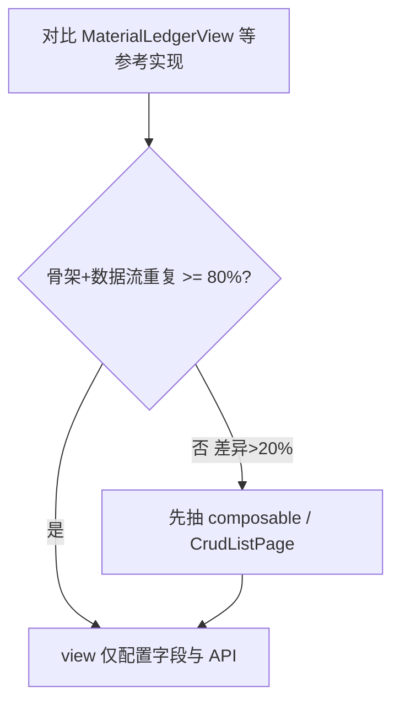

# AGENTS.md — 仓库管理系统

> **维护要求**：每次项目结构、技术栈、约定或功能范围发生变化时，代理必须同步更新本文件。

## 项目概述

- **名称**：仓库管理系统（Storage Management System）
- **上层平台**：项目生命周期管理系统（项目管理平台）
- **所属模块**：项目管理平台 → 资源管理 → 仓库管理
- **远端仓库**：https://github.com/z136606021-star/Storage.git
- **当前阶段**：… + **第二十五期库存统计与项目关联** + **第二十六期客户管理与忘记密码**

## 技术栈

| 层级 | 技术 |
|------|------|
| 前端 | Vue 3、TypeScript、Vite、Ant Design Vue 4、Vue Router、Axios |
| 后端 | Java 17+、Spring Boot 3.3、MyBatis Plus 3.5、Apache POI、Apache Shiro 2 |
| 数据库 | MySQL 8 |
| 对象存储 | MinIO |

## 平台总体架构

本仓库当前实现的是项目生命周期管理系统中的「资源管理 → 仓库管理」能力。新增功能时必须先判断其所属一级域与业务边界，避免把项目管理、采购、财务或系统管理逻辑混入仓库管理模块。

| 一级域 | 子模块/能力 | 当前仓库边界 |
|--------|-------------|--------------|
| 个人中心 | 快捷导航、项目进度统计、待办事项、特别注意事项、工作安排 | 暂不实现；仅在平台壳层导航中保留扩展入口 |
| 项目管理 | 新建项目、项目评估阶段、项目启动阶段、项目规划阶段、项目执行阶段、过程监控阶段、项目收尾阶段 | 暂不实现；仓库模块只消费项目/BOM/采购等上游结果，不承载项目流程编排 |
| 资源管理 | 采购管理、仓库管理、设计指引、技能中心、经验库、财务结算中心 | 当前只实现仓库管理；采购、设计、技能、经验、财务结算均作为后续独立子模块 |
| 系统管理 | 角色管理、用户管理、客户管理 | 用户/角色/菜单管理已实现；**客户管理 CRUD**（Excel 导入导出）已实现 |

### 项目生命周期主流程

项目管理域围绕项目从立项到收尾的生命周期展开：新建项目 → Study → DFA → Buyoff → Award → Design → Make → Install → Debug → Trial → Delivery。流程节点会产生设计方案、BOM 用量表、采购申请、物料入库、安装调试、验收与项目总结等业务动作。

仓库管理只承接与物料相关的资源流转：根据 BOM 或采购需求判断库存，库存不足时进入采购申请，物料到货后入库，并在后续出入库模块中记录项目领用、退库或调整。不得在仓库模块内硬编码项目生命周期审批、客户验收、项目进度更新等项目管理职责。

### 资源管理模块边界

- **采购管理**：采购需求申请、采购审批、采购清单、供应商/合同/采购周期等，后续独立实现。
- **仓库管理**：物料台账、物料出入库、安全库存管理、库存预警与库存统计；这是当前仓库的核心实现范围。
- **设计指引**：图纸/工艺/标准类资料沉淀，后续独立实现。
- **技能中心**：岗位技能、认证、培训或人员能力库，后续独立实现。
- **经验库**：项目复盘、问题案例、知识沉淀，后续独立实现。
- **财务结算中心**：成本分析、财务结算或付款管理，后续独立实现。

## 子系统范围

| 子系统 | 状态 | 路由 | 组件 | API |
|--------|------|------|------|-----|
| 登录页 | Shiro Session 鉴权 + 开放注册 + **忘记密码**（账号+邮箱校验重置）+ **第五期 UI/UX 优化** | `/login`、`/login?tab=register`、`/login?tab=forgot` | `LoginView.vue`、`utils/loginRemember.ts` | `POST /api/auth/login`、`POST /api/auth/register`、`POST /api/auth/forgot-password`、`POST /api/auth/logout`、`GET /api/auth/me` |
| 系统管理 | 用户管理（含角色/菜单子 Tab、多角色、授权只读面板）+ **客户管理 CRUD**（Excel 导入导出）+ Excel 导入导出已实现 | `/system/users`、`/system/users/roles`、`/system/users/menus`、`/system/customers` | `SystemManageLayout.vue`、`UserManageView.vue`、`RoleManagePanel.vue`、`MenuManagePanel.vue`、`CustomerManageView.vue`、`CustomerFormModal.vue` | 用户：`GET/POST/PUT/DELETE /api/system/users`、…；**客户**：`GET/POST/PUT/DELETE /api/system/customers`、`DELETE .../batch`、`GET .../export`、`POST .../import`；角色/菜单同前 |
| 文件上传（MinIO） | 基础设施 + 通用上传 API；**物料清单图片已接入** | — | — | `POST /api/files/upload`（`platform:file:upload` 或 `warehouse:bom:write`） |
| 物料台账 | CRUD + 导入 + 批量操作 + 筛选联动 + **Bin/清单主数据校验** + **从清单选择** + **写权限门禁**（`warehouse:material-ledger:write`）+ **出入库流水删除保护** + **详情跳转出入库** + **只读模板下载** + **`?materialLedgerId=` 深链打开详情** | `/warehouse/material-ledger` | `MaterialLedgerView.vue`、`MaterialLedgerFormModal.vue` | `GET/POST/PUT/DELETE /api/materials`、`DELETE /api/materials/batch`、`GET /api/materials/filter-options`、`GET /api/materials/bin-codes`、`GET /api/materials/bom-catalog`、`GET /api/materials/{id}`、`GET /api/materials/export`、`GET /api/materials/import-template`、`POST /api/materials/import` |
| 物料出入库 | CRUD + 批量入库/出库 + 筛选联动 + **原子 Excel 导入** + **台账选择器** + **深链追溯** + **写权限门禁**；**唯一更新库存**；编辑 PUT 仅 `quantity/remark/purpose/projectRef`；**用途枚举** + **项目编号**（用途=项目领用时必填）+ **安全库存预警** + **补录 operatedAt**；**第二十四期 UI**：`MaterialIoFilterPanel` / `MaterialIoContextBar`、工具栏「更多」、**新增入库/出库下拉**、新增弹窗条件列与预警列 | `/warehouse/material-io` | `MaterialIoView.vue`、`MaterialIoBatchFormModal.vue`、`MaterialIoFilterPanel.vue`、`MaterialIoContextBar.vue`、`MaterialLedgerPickerModal.vue` | 同第二十三期 + `project_ref` |
| 库存统计 | 台账/库存/预警汇总 + 近 N 日出入库笔数与数量 + 预警物料预览（`warehouse:stats:read`） | `/warehouse/inventory-stats` | `InventoryStatsView.vue` | `GET /api/warehouse-stats/overview` |
| 安全库存管理 | 列表（全部台账 LEFT JOIN）+ 8 字段筛选 + 预警黄行 + 导出/批量导出 + 查看/编辑（`warehouse:safety-stock:write`）；预警期 = 开关开启且库存 < 安全库存数；详情跳转台账/出入库（读权限门禁）；无新增/删除/导入 | `/warehouse/safety-stock` | `SafetyStockView.vue`、`SafetyStockFormModal.vue`、`SafetyStockDetailDescriptions.vue` | `GET /api/safety-stock`、`GET /api/safety-stock/filter-options`、`GET /api/safety-stock/{materialLedgerId}`、`PUT /api/safety-stock/{materialLedgerId}`、`GET /api/safety-stock/export` |
| Bin位管理 | CRUD + 导入导出 + 台账引用校验已实现 | `/warehouse/config/bin` | `BinManageView.vue`、`BinFormModal.vue` | `GET/POST/PUT/DELETE /api/warehouse-bins`、`DELETE /api/warehouse-bins/batch`、`GET /api/warehouse-bins/codes`、`GET /api/warehouse-bins/{id}`、`GET /api/warehouse-bins/export`、`GET /api/warehouse-bins/import-template`、`POST /api/warehouse-bins/import` |
| 物料清单管理 | CRUD + 品类联动筛选 + 导入导出 + **MinIO 图片上传/预览** + 台账引用删除保护 | `/warehouse/config/bom` | `BomManageView.vue`、`BomFormModal.vue` | `GET/POST/PUT/DELETE /api/warehouse-boms`、`DELETE /api/warehouse-boms/batch`、`GET /api/warehouse-boms/filter-options`、`GET /api/warehouse-boms/{id}`、`GET /api/warehouse-boms/export`、`GET /api/warehouse-boms/import-template`、`POST /api/warehouse-boms/import`；图片经 `POST /api/files/upload` 上传，DB 存 `image_object_key`，API 动态返回 `imageUrl` |
| 平台壳层 | **占位页**（个人中心/项目/采购/设计/技能/经验/财务） | `/platform/*` | `ShellPlaceholderView.vue` | — |

### 平台基础能力

- **鉴权**：Apache Shiro Session + Cookie；`sys_user/role/menu` 表；开放注册默认 `USER` 角色（只读物料台账）；`composables/useAuth.ts`（含 `hasPermission`）+ `router/guards.ts`（含 `meta.permission`）+ `http` 拦截器。
- **动态菜单**：`GET /api/menus/nav-tree` 按权限过滤；[SideMenu.vue](frontend/src/components/layout/SideMenu.vue) 从 API 加载；ADMIN 可见完整平台壳层，仓库管理下 5 项（台账 / 出入库 / 安全库存 / **库存统计** / 配置管理 → Bin位、物料清单）；默认展开资源管理 → 仓库管理。
- **动态 TabBar**：[useWorkbenchTabs.ts](frontend/src/composables/useWorkbenchTabs.ts) + [TabBar.vue](frontend/src/components/layout/TabBar.vue)；ADMIN 登录预置「个人中心」「项目中心」，访问业务页自动追加 Tab，可切换/关闭；USER 仅预置物料台账 Tab。
- **壳层路由注册表**：[shellRouteRegistry.ts](frontend/src/constants/shellRouteRegistry.ts) 与 `migration-phase7-ui-shell-paths.sql` 对齐 DB `sys_menu.path`。
- **对象存储**：MinIO（`docker-compose`）；`FileStorageService` + `POST /api/files/upload`；物料清单保存 `image_object_key`，列表/详情 API 附带预签 `imageUrl`。
- **路由守卫**：`requiresAuth` 业务路由未登录时重定向 `/login`；登录页静态资源见 `frontend/src/assets/auth/`；**记住密码**用 `utils/loginRemember.ts` 仅存账号至 localStorage（不传 Shiro RememberMe）；Tab 可通过 `?tab=register` 或 `?tab=forgot` 切换。

### 物料台账字段

筛选：品类、统称、品牌、名称（关键字）、型号、Bin位；支持品类→统称→品牌联动收窄选项（Bin 位选项来自 `warehouse_bin` 主数据，非台账 DISTINCT）。表格：序号、品类、统称、品牌、名称、型号、Bin位、库存数量、单价、备注、操作（查看；**编辑/删除仅 `warehouse:material-ledger:write`**）。导出按当前筛选条件导出全部匹配记录；勾选行支持批量导出与批量删除（写权限）；支持 Excel 导入与模板下载。查看详情为右侧只读抽屉。新增/编辑弹窗**独立加载** `filter-options` + `bom-catalog`（不依赖列表页筛选项）；**库存数量只读**（新建默认 0，变更走物料出入库模块）；保存/导入时 Bin 位须在 Bin 主数据中存在，**品类/统称/品牌/名称四元组须在物料清单中存在**；表单支持「从清单选择」自动填充四元组（`GET /api/materials/bom-catalog`）。

### 物料出入库字段

筛选：品类、统称、品牌、名称（关键字）、型号、Bin位、操作类型、**用途（随操作类型联动）**、**项目编号（关键字）**、操作时间区间、`materialLedgerId`（台账深链）、`id`（流水深链打开详情）；专用 [`MaterialIoFilterPanel`](frontend/src/components/warehouse/MaterialIoFilterPanel.vue)。表格：序号、品类、统称、品牌、名称、型号、Bin位、数量、**用途（Tag）**、**项目编号**、备注、操作类型（Tag 色）、操作人、操作时间、操作（查看；**编辑/删除仅 `warehouse:material-io:write`**）。工具栏：**新增（入库/出库下拉）** / 导出 / 导入；**下载模板 / 批量导出 / 批量删除** 收入「更多」下拉。深链上下文条：[`MaterialIoContextBar`](frontend/src/components/warehouse/MaterialIoContextBar.vue)（Tag 式紧凑展示 + 一键入库/出库）。新增为批量表单：顶栏一行化（类型 + 操作时间 + 新增行）；**入库隐藏用途/库存列**；**出库显示用途/可用库存/项目编号/独立预警列**（项目领用须填项目编号）；未选物料点击身份格选择；出库表头汇总预警 + 提交前 confirm（可勾选本次会话不再提示）。编辑禁止改操作类型与物料（PUT 仅 quantity/remark/purpose/projectRef）；重复物料硬拦截；切换出库时即时库存校验。台账详情可跳转 `?materialLedgerId=` 查看该物料流水；出入库详情跳转台账须 `warehouse:material-ledger:read`；`?id=` 深链时列表附加 `ids` 筛选确保行可见与高亮；点「查看」同步 URL；详情支持「复制链接」；关闭详情抽屉清除 `id` 参数并保留 `materialLedgerId` 筛选。Excel 导入全表预校验（含同文件出库累计超库存行级报错、出库用途校验、可选操作时间列）、锁内单事务写入。后端集成测试：`mvn test -Dspring.profiles.active=test`；前端单测：`cd frontend && npm run test`。

## 仓库约定

- **默认分支**：`main`
- **提交规范**：Conventional Commits（`feat:`、`fix:`、`chore:`）
- **忽略文件**：见 [.gitignore](.gitignore)
- **环境变量**：参考 [.env.example](.env.example)，勿提交 `.env`

## 代理工作指引

1. **更新本文件**：新增模块、路由、API、技术栈或目录结构时同步更新
2. **子系统实现**：新页面实现后更新「子系统范围」表
3. **不提交敏感信息**：数据库密码、API Key 等不入库
4. **保持 README 同步**：启动方式变化时更新 [README.md](README.md)

## 模块复用与可维护性门禁

> **强制要求**：代理在新增页面、API、表结构或业务逻辑前，必须先完成复用检查并优先使用现有公共模块，禁止为赶进度重复造轮子。

### 开发前检查清单

实现任何新功能前，必须先检索以下目录是否已有可复用能力：

| 层级 | 检索路径 | 典型复用物 |
|------|----------|------------|
| 前端组件 | `frontend/src/components/`、`frontend/src/layouts/` | 布局壳层、筛选区、表格包装、弹窗/抽屉 |
| 前端 API | `frontend/src/api/`、`frontend/src/types/` | Axios 封装、分页类型、筛选参数、实体类型 |
| 后端通用 | `backend/.../config/`、`backend/.../exception/`、`backend/.../dto/` | CORS、全局异常、分页响应、校验 DTO |
| 后端业务 | `backend/.../service/`、`backend/.../mapper/` | 分页查询、导入导出、批量操作 |
| 数据库 | `backend/src/main/resources/db/` | 表命名、字段命名、种子/迁移脚本 |
| 文档 | `AGENTS.md`、`README.md` | 子系统范围、API 列表、目录结构 |

### 分层职责

- **页面（views）**：只做路由入口、状态编排与组件组合，不写大段重复 UI 或请求逻辑。
- **组件（components）**：可复用 UI 必须下沉到 `components/common/` 或 `components/warehouse/`，禁止在多个 view 内复制粘贴相同模板。
- **API 层（api + types）**：每个资源一个模块文件；分页、筛选、导出等模式保持统一签名，不各写一套。
- **后端 Service**：分页、异常处理、导入导出、DTO 转换优先抽共享 helper 或基类，禁止每个 Controller 复制相同样板代码。
- **数据库**：相同业务含义只用一套字段名（如 `generic_name`、`bin_location`）；状态/类型优先字典表或统一枚举，避免子系统各搞一套。

### 仓库管理同类 CRUD 复用标准

仓库域多个子模块（物料台账、出入库、安全库存、Bin位、物料清单）及系统管理中的用户/角色列表，本质均为**筛选 + 分页表格 + 弹窗/抽屉 + 导入导出**的增删改查，差异主要在表结构、字段与 API，应配置化或引用公共组件，禁止各写一整份 view。

**参考实现**（实现前必须打开对比）：

| 优先级 | 文件 | 说明 |
|--------|------|------|
| 主参考 | [`MaterialLedgerView.vue`](frontend/src/views/material-ledger/MaterialLedgerView.vue) | 仓库域完整 CRUD + 筛选联动 + 导入导出 |
| 次参考 | [`UserManageView.vue`](frontend/src/views/system/UserManageView.vue) | 系统管理同类列表页模式 |

**实现前强制步骤**：

1. 对比至少两个已有实现（优先物料台账 + 与目标最接近的 view）。
2. 列出可复用层：`http` / `types` / `utils` / 后端 `query`+`excel`+`converter` / 前端筛选区+表格+弹窗模式。
3. 在 PR 或代理说明中写明「复用结论」：引用哪些公共模块，或为何差异不可避免。

**20% 差异门禁**（跨模块整体红线，与下文「30 行单次复制」并存，任一触发都须先抽象）：

| 维度 | 一致部分（应复用） | 允许差异部分（计入差异） |
|------|-------------------|-------------------------|
| 页面骨架 | 筛选区、工具栏、分页表、空态/加载、确认删除 | — |
| 数据流 | 分页查询、`buildQueryParams`、`handleTableChange` | — |
| 导入导出 | `downloadBlob`、模板下载、按筛选导出 | 列定义、Excel 契约 |
| 业务 | — | 字段、校验规则、联动筛选、权限码 |

若新页面与参考实现在**骨架 + 数据流**上预计重复代码占比 **< 80%**（即不一致 **> 20%**），复用性与可控性几乎为零，**必须先抽象再写业务**，禁止再复制一整份 view。已落地公共层：

- `frontend/src/composables/usePaginatedCrudList.ts` — 分页列表加载、搜索、表格变更、行勾选
- `frontend/src/composables/useExcelImportExport.ts` — 导入/导出/模板下载
- `frontend/src/composables/useLinkedFilterOptions.ts` — 仓库域联动筛选底层
- `frontend/src/composables/useWarehouseMaterialFilters.ts` + `WarehouseMaterialFilterPanel.vue` — 6 字段物料筛选
- `frontend/src/composables/useMaterialLedgerDeepLink.ts` — 出入库 `?materialLedgerId=` 列表筛选深链
- `frontend/src/composables/useMaterialLedgerRouteDetail.ts` — 台账 `?materialLedgerId=` 打开详情深链
- `frontend/src/components/warehouse/MaterialIdentityDescriptions.vue` — 详情物料身份块
- `frontend/src/composables/useWritePermission.ts` — 写权限 computed 门禁
- `frontend/src/composables/useCrudDetailDrawer.ts` — 详情抽屉加载态
- `frontend/src/components/common/CrudListPage.vue` — 筛选/表格/工具栏插槽布局壳
- `frontend/src/components/common/CrudToolbar.vue` — 通用 CRUD 工具栏
- `frontend/src/components/common/CrudDetailDrawer.vue` — 详情抽屉壳（含可选编辑按钮）
- `frontend/src/components/common/CrudRowActions.vue` — 查看/编辑/删除操作列
- `frontend/src/utils/confirmDelete.ts` — 删除确认（含 `confirmBatchDelete`）
- `frontend/src/utils/importResult.ts` — 导入结果提示
- `frontend/src/utils/tableIndex.ts` — 分页序号列
- `frontend/src/utils/warehouseMaterialTable.ts` — 物料六字段 query/列定义 SSOT
- `frontend/src/utils/materialLedgerRouteQuery.ts` — `?materialLedgerId=` 解析 SSOT
- `frontend/src/utils/materialIoRouteQuery.ts` — 出入库 `?id=` 解析 SSOT
- `frontend/src/constants/materialIoPurpose.ts` — 出入库用途枚举 SSOT
- `frontend/src/composables/useCrudRouteDetail.ts` — 通用 `?queryKey=` 深链打开详情（IO/台账薄包装）
- `frontend/src/composables/useMaterialIoList.ts` — 出入库分页列表（含 ioType/操作时间/用途筛选）
- `frontend/src/composables/useMaterialIoSafetyHint.ts` — 出库安全库存预警提示
- `frontend/src/composables/useSafetyStockList.ts` — 安全库存分页列表（含安全库存数/预警期筛选）
- `frontend/src/composables/useMaterialIoRouteDetail.ts` — 出入库 `?id=` 自动打开详情
- `frontend/src/composables/useMaterialLedgerList.ts` — 台账分页列表（台账页 + 选择器）
- `frontend/src/views/warehouse/_shared/warehouseListScaffold.ts` — 后续仓库 CRUD 页脚手架注释
- 各 view 只保留：列配置、表单字段、资源专属 API 绑定



### 禁止事项

- 禁止在未检查现有代码的情况下新建功能相近的组件、Service、DTO 或 API 文件。
- 禁止把通用逻辑长期留在某个子系统 view 或 Controller 内。
- 禁止为单个页面硬编码本应从 `filter-options` 或字典接口获取的下拉数据。
- 禁止复制粘贴超过 30 行且结构相同的代码而不抽象；若确不抽象，须在 PR/说明中写明理由。
- 禁止仓库域 CRUD 在**骨架 + 数据流**上与参考实现差异 **> 20%** 仍不复用公共层；禁止在未对比 `MaterialLedgerView` 的情况下从零生成完整列表页。
- 禁止代理一次性向多个 view 提交数百行重复模板而不抽公共层；禁止把「能跑」当作合入标准。

### 代理执行要求

1. **先说明复用结论**：开始编码前，用一两句话说明「复用了哪些现有模块」或「为何需要新建模块」；**仓库域 CRUD 须对照 `MaterialLedgerView` 并满足 20% 差异门禁**。
2. **新建公共模块时同步文档**：在「目录结构」与本文件记录其用途、边界、调用方。
3. **Worktree 并行开发**：公共能力优先合入 `main`，各功能分支通过 `git merge origin/main` 同步，不在多个分支各自维护一份相同公共代码。当前 worktree：`main`（`E:/Storage`）、`feat/material-ledger`（`E:/Storage-worktrees/material-ledger`）、`feat/material-io`、`feat/safety-stock`、`feat/config-mgmt`（`E:/Storage-worktrees/config-mgmt`）。**切换 worktree 或分支后必须先执行 `scripts/sync-worktree-env.ps1`**，确认 MySQL 端口与当前分支一致后再启 Docker / 后端。
4. **重构优先于堆叠**：发现重复实现时，优先抽取再扩展，而非再写第三份副本。

### 协作与 AI 使用原则

适用于维护者与 Cursor Agent，强调**补全式、可审查**开发，避免黑盒式整包生成。

- **补全式优先**：采用 Cursor/Copilot 式「边写边看」——小步修改、即时审阅 diff，而非一次性生成整个子系统且不知写了什么。
- **可控性要求**：
  - 编码前说明复用结论与**拟改文件清单**；禁止未经确认跨多文件大块生成。
  - 单次变更聚焦一个子模块或一层（如先 API/types，再 composable，再 view）；避免单 PR 同时铺开多个仓库 CRUD 页。
  - 维护者须在 IDE 中**逐文件审查** diff 后再合并；不清楚内容的代码不得合入。
- **合入标准**：仓库域 CRUD 须**可维护、可对比、差异可解释**；与参考实现差异须有文档说明，不得仅追求「能跑」。

### Worktree 数据库隔离

各 worktree 拥有**独立的 MySQL / MinIO 端口、容器名与 Docker 数据卷**；逻辑库名均为 `storage`，隔离靠端口 + 卷。注册表 SSOT：[`scripts/worktree-db.ps1`](scripts/worktree-db.ps1)。

| 分支 | Worktree | MySQL | MinIO API | Compose 项目 |
|------|----------|-------|-----------|--------------|
| `main` | `E:/Storage` | 3307 | 9000 | `storage-main` |
| `feat/material-ledger` | `E:/Storage-worktrees/material-ledger` | 3308 | 9010 | `storage-material-ledger` |
| `feat/material-io` | `E:/Storage-worktrees/material-io` | 3309 | 9020 | `storage-material-io` |
| `feat/safety-stock` | `E:/Storage-worktrees/safety-stock` | 3310 | 9030 | `storage-safety-stock` |
| `feat/config-mgmt` | `E:/Storage-worktrees/config-mgmt` | 3311 | 9040 | `storage-config-mgmt` |

#### 日常流程

```powershell
cd E:\Storage-worktrees\material-io
git checkout feat/material-io
.\scripts\dev-up.ps1                      # 推荐：一键 sync + docker + 前后端
# 或分步：
.\scripts\sync-worktree-env.ps1
docker compose --env-file .env up -d
.\scripts\start-dev.ps1
```

`start-dev.ps1` / `reset-db.ps1` 启动时会自动 sync；手动改分支后建议显式执行一次 `sync-worktree-env.ps1`。

#### 隔离原则

- **代码在 Git 里合并，数据库永不合并**；每个 worktree 对应独立 Docker 卷，互不可见。
- **在哪个分支写代码，就用哪个分支的 `.env` 与端口**；禁止用 main 的 3307 卷测试 feature 分支代码。
- **禁止**在未确认目录/分支时对 `docker compose down -v`（会删错卷）。
- **禁止**把 A 分支 mysqldump 导入 B 分支端口（除非明确在做数据迁移）。
- `.env` 不入库；端口分配只改 `worktree-db.ps1` 一处。

#### Git 合并时（不能弄混）

| 场景 | 正确做法 |
|------|----------|
| feature 新增 `migration-*.sql` | 脚本保持幂等（`IF NOT EXISTS` / `INSERT IGNORE` / UPDATE 修复中文）；合并后各 worktree **各自重启后端**，迁移只作用于**本卷** |
| 修改 `schema.sql` 种子 | 只影响**新初始化**的空卷；已有卷靠 migration 或 `reset-db.ps1` |
| `main` 合并进 feature | 先 `git merge`，再 `sync-worktree-env`，再启后端；不要用 main 的 Docker 卷测 feature |
| PR / 代理说明 | 若变更 DB 结构，注明「各 worktree 需重启后端；是否需 reset-db 由开发者自判」 |
| 代理执行 | 在 feature worktree 开发时连接该分支注册端口；合入 main 时在 **main 目录**验证，不跨端口读库 |

#### 一次性迁移说明

从旧版共用 `material-ledger-*` 容器 / `storage_mysql_data` 卷迁移时：运行 `scripts/cleanup-legacy-docker.ps1`，再执行 `sync-worktree-env` + `docker compose --env-file .env up -d` 创建 `storage-{slug}_*` 新卷。若需保留 main 现有数据，迁移前先 `mysqldump` 备份再导入新 `storage-main-mysql` 容器。

### 第八期 DevX

日常开发优先使用 [`scripts/dev-up.ps1`](scripts/dev-up.ps1) / [`dev-up.cmd`](dev-up.cmd)（sync + Docker + wait MySQL + start-dev）。

| 脚本 | 用途 |
|------|------|
| `dev-up.ps1` | 一键启动完整开发环境 |
| `health-check.ps1` | 只读自检（分支、.env、容器、中文、前后端）；退出码 0/1 |
| `cleanup-legacy-docker.ps1` | 清理第七期前 `material-ledger-*` 遗留容器 |
| `wait-mysql.ps1` | 轮询 MySQL 端口与 `SELECT 1`，供 dev-up/reset-db 复用 |
| `sync-worktree-env.ps1` | 按分支生成本地 `.env` |

**代理执行要求（DevX）**：

- 切换 worktree 或启动开发环境前，建议先跑 `health-check.ps1`；失败时先排查，**不要**擅自 `docker compose down -v`。
- 物料台账中文乱码：重启后端触发 `migration-fix-chinese-data.sql`（含 `material_ledger` 幂等 UPDATE）；仍异常再用 `reset-db.ps1`。
- 遇端口占用且存在 `material-ledger-*`：先 `cleanup-legacy-docker.ps1`，再 `dev-up`。

## 目录结构

```
Storage/
├── frontend/                 # Vue3 + TS + Ant Design Vue 4
│   └── src/
│       ├── api/
│       │   ├── http.ts           # 共享 axios（withCredentials + 401 拦截）
│       │   ├── auth.ts           # 登录/注册/登出/当前用户
│       │   ├── menu.ts           # 导航树
│       │   ├── system/           # 用户/角色/客户管理 API
│       │   ├── materialLedger.ts # 物料台账 API
│       │   ├── materialIo.ts     # 物料出入库 API
│       │   ├── safetyStock.ts    # 安全库存 API
│       │   ├── warehouseStats.ts # 库存统计 API
│       │   ├── file.ts           # 通用文件上传 API
│       │   ├── warehouseBin.ts   # Bin位管理 API
│       │   └── warehouseBom.ts   # 物料清单 API
│       ├── composables/
│       │   ├── useAuth.ts              # 登录态 composable（hasPermission）
│       │   ├── useWorkbenchTabs.ts       # 顶部 Tab 状态
│       │   ├── usePaginatedCrudList.ts   # 分页 CRUD 列表通用逻辑
│       │   ├── useExcelImportExport.ts   # Excel 导入导出
│       │   ├── useLinkedFilterOptions.ts # 联动筛选底层
│       │   ├── useWarehouseMaterialFilters.ts # 6 字段物料筛选 composable
│       │   ├── useMaterialLedgerDeepLink.ts # 出入库台账深链筛选
│       │   ├── useMaterialIoList.ts      # 出入库分页列表
│       │   ├── useSafetyStockList.ts   # 安全库存分页列表
│       │   ├── useCrudRouteDetail.ts     # 通用深链打开详情
│       │   ├── useMaterialIoRouteDetail.ts # 出入库流水深链打开详情
│       │   ├── useMaterialLedgerRouteDetail.ts # 台账深链打开详情
│       │   ├── useMaterialLedgerList.ts  # 台账分页列表（台账页+选择器）
│       │   ├── useWritePermission.ts     # 写权限门禁
│       │   ├── useCrudDetailDrawer.ts    # 详情抽屉
│       │   ├── useMaterialIoStock.ts     # 出入库可用库存计算
│       │   └── useMaterialIoSafetyHint.ts # 出库安全库存预警
│       ├── components/
│       │   ├── layout/           # SideMenu（动态菜单）、TabBar
│       │   ├── common/           # ComingSoonPage、CrudListPage、CrudToolbar、CrudDetailDrawer、CrudRowActions
│       │   ├── system/           # RoleManagePanel、MenuManagePanel、CustomerFormModal
│       │   └── warehouse/        # …、MaterialIoFilterPanel、MaterialIoContextBar、MaterialIoBatchFormModal、SafetyStockDetailDescriptions
│       ├── constants/
│       │   ├── filter.ts         # 筛选常量（ALL_OPTION）
│       │   ├── materialIoPurpose.ts # 出入库用途枚举 SSOT
│       │   └── shellRouteRegistry.ts # 壳层占位路由 SSOT
│       ├── assets/auth/          # 登录页静态资源
│       ├── layouts/AppLayout.vue
│       ├── router/
│       │   ├── index.ts          # createRouter + 注册守卫
│       │   ├── routes.ts         # 路由表（含 system/*）
│       │   ├── guards.ts         # beforeEach 登录与 permission 拦截
│       │   └── meta.d.ts         # RouteMeta 类型扩展
│       ├── types/
│       │   ├── common.ts         # PageResult、ImportResult 等通用类型
│       │   ├── auth.ts
│       │   ├── system.ts
│       │   ├── materialLedger.ts
│       │   ├── materialIo.ts
│       │   ├── safetyStock.ts
│       │   ├── warehouseStats.ts
│       │   ├── customer.ts
│       │   ├── file.ts
│       │   ├── warehouseBin.ts
│       │   └── warehouseBom.ts
│       ├── utils/                # download、format、confirmDelete、importResult、tableIndex、warehouseMaterialTable、materialLedgerRouteQuery、materialIoRouteQuery、materialIoShareUrl、selectOptions、icons、loginRemember
│       ├── views/auth/
│       │   └── LoginView.vue     # 登录/注册
│       ├── views/system/         # SystemManageLayout、UserManageView、CustomerManageView
│       ├── views/platform/       # ShellPlaceholderView
│       ├── views/warehouse/      # MaterialIoView、SafetyStockView、InventoryStatsView；config/BinManageView、BomManageView；_shared/warehouseListScaffold.ts
│       └── views/material-ledger/
│           └── MaterialLedgerView.vue
├── backend/                  # Spring Boot 3 + MyBatis Plus
│   └── src/main/java/com/storage/
│       ├── controller/       # Auth、System、Material、MaterialIo、SafetyStock、WarehouseStats、WarehouseBin/Bom、File、MenuNav
│       ├── config/           # CORS、Shiro、MinIO、WebMvc
│       ├── shiro/            # Realm、ShiroConfig、SubjectBindingFilter
│       ├── converter/        # DTO ↔ Entity 转换
│       ├── dto/
│       ├── entity/
│       ├── excel/            # Excel 列契约与 POI 工具
│       ├── exception/        # 全局异常（可复用）
│       ├── mapper/
│       ├── query/            # 查询条件构建
│       ├── service/            # 业务 Service；含 MaterialStockMutationService（库存锁定/增减）
│       └── web/              # Excel 响应构建
├── docker-compose.yml        # MySQL 8 + MinIO（端口/卷由 .env 参数化，含 healthcheck）
├── dev-up.cmd                # 一键环境 + 前后端（第八期推荐入口）
├── scripts/
│   ├── worktree-db.ps1       # Worktree 分支→端口/容器/卷注册表（SSOT）
│   ├── sync-worktree-env.ps1 # 按当前分支生成本地 .env
│   ├── dev-up.ps1            # sync + docker + wait-mysql + start-dev
│   ├── health-check.ps1      # 开发环境只读自检
│   ├── cleanup-legacy-docker.ps1 # 清理 material-ledger-* 遗留容器
│   ├── wait-mysql.ps1        # MySQL 就绪轮询
│   ├── start-dev.ps1         # 启动前后端（自动 sync + 注入 DB 环境变量）
│   └── reset-db.ps1          # 重置当前 worktree 的 Docker 卷
├── .env.example
├── AGENTS.md
└── README.md
```

## 变更日志

| 日期 | 变更 |
|------|------|
| 2026-06-23 | 初始化 Git 仓库、.gitignore、AGENTS.md、README.md；首次推送到 GitHub |
| 2026-06-23 | 物料台账首版：前后端工程、MySQL 种子数据、完整壳层 UI、分页查询 API |
| 2026-06-23 | 物料台账二版：查看详情抽屉、按筛选条件导出 Excel、列表页 UI 优化 |
| 2026-06-23 | 物料台账三版：CRUD、Excel 导入、批量导出/删除、筛选联动、种子数据精简 |
| 2026-06-23 | 新增模块复用与可维护性门禁；main 合并物料台账 v2/v3 并同步至功能分支 |
| 2026-06-23 | 复用基础层：前端 http/types/utils/constants、后端 converter/query/excel/web |
| 2026-06-24 | 补充项目生命周期管理系统总体架构、一级域划分与仓库管理边界 |
| 2026-06-24 | 登录页 UI 第一期：`/login` 独立页、设计稿还原、路由默认入口 |
| 2026-06-24 | 鉴权第二期：Apache Shiro Session、用户/角色/菜单表、API 保护、前端登录打通 |
| 2026-06-24 | MinIO 对象存储基础设施与 `POST /api/files/upload` |
| 2026-06-24 | 系统管理第四期：用户/角色嵌套路由 Tab、授权只读面板、用户/角色 Excel、客户管理占位、移除菜单管理 UI |
| 2026-06-24 | 登录页第五期：左栏科技插画、localStorage 记住账号、URL Tab 同步、注册 3-32/密码≥6 校验、登录交互优化 |
| 2026-06-24 | 第六期平台壳层 UI：`migration-phase6-platform-shell.sql` 完整导航种子、仓库 4 项（配置管理含 Bin位/物料清单）、占位路由与 `ComingSoonPage`、新建 `feat/config-mgmt` worktree |
| 2026-06-24 | 第七期壳层 UI 补全：动态 TabBar（`useWorkbenchTabs`）、壳层 `/platform/*` 占位路由、`migration-phase7-ui-shell-paths.sql`、侧栏默认展开 |
| 2026-06-25 | Worktree 数据库隔离：`worktree-db.ps1` 五分支独立端口/卷、`sync-worktree-env.ps1`、参数化 `docker-compose.yml`、AGENTS 合并规范 |
| 2026-06-25 | 第八期 DevX：`dev-up`、`health-check`、`cleanup-legacy-docker`、`wait-mysql`、`material_ledger` 中文修复、MySQL healthcheck |
| 2026-06-25 | AGENTS：仓库同类 CRUD 20% 复用门禁与协作式 AI（补全式、可审查）原则 |
| 2026-06-25 | 第九期系统管理 RBAC 补全：恢复菜单管理 Tab（`/system/users/menus`）、`MenuManagePanel` CRUD、用户表单多角色分配 |
| 2026-06-25 | 第十期 CRUD 复用层：`usePaginatedCrudList`、`useExcelImportExport`、`useLinkedFilterOptions`、`CrudListPage`、`CrudToolbar`；物料台账/用户/角色列表页迁移至公共层 |
| 2026-06-25 | 第十一期 Bin位管理：`warehouse_bin` 表与 CRUD/Excel API、`BinManageView`；台账 Bin 下拉改读主数据、保存/导入校验；`GET /api/materials/bin-codes` |
| 2026-06-25 | 第十一期 11.2 物料清单：`warehouse_bom` 表与 CRUD/Excel API、`BomManageView`（品类联动筛选；图片列占位；从台账 DISTINCT 回填种子） |
| 2026-06-25 | 第十一期 11.3 台账 ↔ 清单：`GET /api/materials/bom-catalog`、表单「从清单选择」、四元组严格校验、清单删除台账引用保护 |
| 2026-06-25 | 第十一期 11.4 物料清单 MinIO 图片：`image_object_key` 字段、`BomFormModal` 上传/预览/清除、列表与详情缩略图；上传权限 OR `warehouse:bom:write` |
| 2026-06-25 | 第十二期物料台账编辑链路：修复 `warehouse_bom.image_object_key` 迁移（MySQL 兼容）；编辑弹窗独立加载选项与 bom-catalog；`MaterialLedgerView` 写权限门禁对齐 Bin/用户管理 |
| 2026-06-25 | 第十三期 CRUD 复用层补全：`confirmBatchDelete`、`useWritePermission`、`useCrudDetailDrawer`、`CrudDetailDrawer`、`CrudRowActions`、`getTableRowIndex`；台账/Bin/清单三页迁移；台账 Bin 筛选改走 `filter-options.binLocations` |
| 2026-06-25 | 第十三期物料出入库：`material_io_record` 表与 CRUD/Excel API、`MaterialIoView` 批量入库/出库、`MaterialLedgerPickerModal`、`warehouse:material-io:write`；`material_ledger.stock_quantity` 唯一由出入库模块写入 |
| 2026-06-26 | 第十四期物料出入库完善：筛选联动 bug 修复、Excel 原子导入 `importBatch`、台账选择器 composables 升级、批量表单库存列/实时库存、台账删除 IO 引用保护、`CrudToolbar` 模板只读下载 |
| 2026-06-26 | 第十五期物料出入库优化：H2 集成测试、`useMaterialIoStock`、可用库存列、编辑禁改类型、出库选择器零库存拦截、`materialLedgerId` 深链追溯、台账详情跳转出入库、删除占位页 |
| 2026-06-26 | 第十六期物料出入库复用与契约：`useWarehouseMaterialFilters`/`WarehouseMaterialFilterPanel` 消除三处筛选重复、`useMaterialLedgerDeepLink`、`MaterialIdentityDescriptions`、出库 InputNumber max、IO↔台账互跳、台账只读模板下载；后端禁改 ioType、批量重复物料拦截、`MaterialLedgerService.findByMaterialKey` |
| 2026-06-26 | 第十七期追溯闭环与测试：`useMaterialLedgerRouteDetail` 台账 `?materialLedgerId=` 自动打开详情；`importBatch`/Excel 导入重复物料拦截；`MaterialIoImportServiceIntegrationTest` + Service 层 ioType/查询/重复测试扩展 |
| 2026-06-26 | 第十八期追溯体验与复用深化：深链 `?materialLedgerId=` 新增预填、上下文条补全、IO↔台账读权限对称；编辑禁改物料（前后端）；`warehouseMaterialTable`/`materialLedgerRouteQuery`/`useMaterialLedgerList`/`MaterialIoDetailDescriptions`；台账页与选择器共用列表 composable |
| 2026-06-26 | 第十九期流水深链与质量基建：`useMaterialIoRouteDetail` + `?id=` 打开出入库详情；`MaterialStockMutationService` 库存逻辑下沉；Vitest 基建 + `useMaterialIoStock` 单测 |
| 2026-06-26 | 第二十期列表复用与深链闭环：`useMaterialIoList` 抽取瘦身 `MaterialIoView`；`?id=` 列表 `ids` 定位 + 查看 URL 同步；Excel 导入出库超库存行级 `ImportResultVO`；`MaterialStockMutationServiceTest` + 深链/route Vitest 扩展 |
| 2026-06-26 | 第二十一期追溯快捷与契约瘦身：上下文条一键新增入库/出库、`useCrudRouteDetail`、`MaterialIoUpdateDTO`、详情复制链接 |
| 2026-06-26 | 第二十二期安全库存管理：`safety_stock` 表与 API、`SafetyStockView`、预警黄行、导出/编辑 upsert、`warehouse:safety-stock:write`、H2 集成测试 |
| 2026-06-29 | 第二十三期出入库业务语义：`purpose` 用途枚举、出库必填、列表筛选/Excel；`GET /api/material-io/safety-hints` 出库预警；新增补录 `operatedAt`；`useMaterialIoSafetyHint` |
| 2026-06-29 | 第二十六期客户管理与忘记密码：`sys_customer` CRUD/Excel、`CustomerManageView`、`POST /api/auth/forgot-password`、登录页 `?tab=forgot` |
| 2026-06-29 | 第二十四期出入库 UI 优化：`MaterialIoFilterPanel`、`MaterialIoContextBar`、工具栏「更多」、用途 Tag 列、新增弹窗顶栏/条件列/预警列、安全确认 checkbox |
| 2026-06-29 | 第二十七期差距收敛：文档与客户占位表述同步、台账路由读权限、死代码清理、注册可选邮箱 + admin 种子邮箱、库存统计 `recentDays` 选择器、台账/Bin/客户 import 集成测试、GitHub Actions CI |
