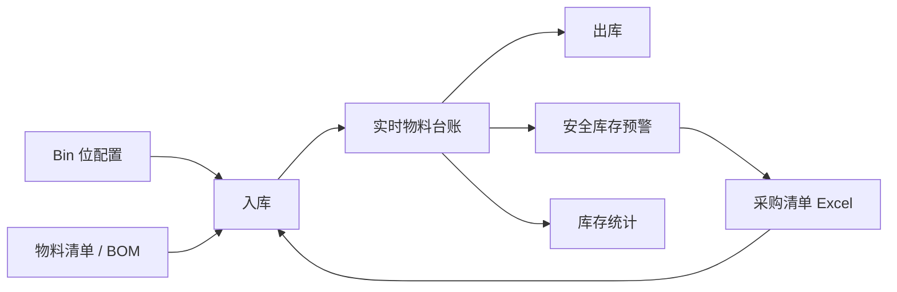

# 仓库管理系统

本项目是项目生命周期管理平台的「资源管理 -> 仓库管理」模块。当前仓库管理主流程已经接近完成，默认交付范围包括个人中心、仓库管理和系统管理；项目管理、采购审批、财务结算、客户验收等平台能力不属于本模块。

截至 **2026-07-16**，默认侧栏开放：

- **个人中心**：账号信息、手机号维护、原密码改密、邮箱验证码改密。
- **仓库管理**：库存统计、物料台账、物料出入库、安全库存、Bin 位管理、物料清单。
- **系统管理**：用户、角色、菜单、客户和异常日志。

设计指引和经验库已有独立域基础实现，但当前菜单默认隐藏，暂不作为本阶段正式交付入口；后续功能与验收范围另行确定。

## 当前交付状态

| 范围 | 状态 | 当前能力 |
|------|------|----------|
| 仓库管理 | 接近完成 | 配置、入库、出库、实时台账、安全库存、统计、采购清单和 Excel 流程已闭环 |
| 个人中心 | 可用 | 登录、注册、找回密码、资料与密码维护 |
| 系统管理 | 可用 | 用户、角色、菜单、客户、异常日志与权限控制 |
| 设计指引 | 暂缓开放 | 基础 CRUD/配置/Excel 已实现，默认菜单隐藏 |
| 经验库 | 暂缓开放 | 类型、记录、附件与 Excel 基础能力已实现，默认菜单隐藏 |
| 其他平台模块 | 待开发 | 项目、采购、财务等不在当前仓库管理交付范围 |

仓库模块已具备日常使用条件，但正式发布前仍需在目标环境完成 Compose 健康检查、真实数据验收、生产凭据轮换和备份恢复演练。

## 仓库业务流程



核心业务约束：

1. Bin 位和物料清单是入库的配置来源；入库选择 BOM 物料和 Bin 位。
2. 物料台账是实时库存结果视图，不允许从台账页面直接修改库存。
3. 出库必须选择现有台账，且数量不得超过可用库存。
4. 新增、编辑或删除出入库流水会同步维护库存；流水保留单价快照、用途、项目编号、操作人和操作时间。
5. 库存小于等于安全库存数时触发预警；采购清单仅提供补货建议，不承接采购审批或财务结算。
6. 台账、流水、安全库存之间支持详情跳转和 URL 深链追溯。

### 仓库功能清单

- **库存统计**：库存总量、预警概览、近期出入库统计及台账定位。
- **物料台账**：组合筛选、分页、详情、按条件或勾选导出；默认仅显示有库存记录。
- **物料出入库**：批量入库/出库、编辑、删除、库存校验、安全库存提示、Excel 导入导出和模板下载。
- **安全库存**：按物料维护阈值、预警置顶高亮、导出安全库存和生成采购清单。
- **Bin 位管理**：排/列/层配置、自动生成 Bin 编号、CRUD、引用保护和 Excel 导入导出。
- **物料清单**：物料主数据、规格、备注、多图片、重复校验、引用保护和 Excel 导入导出。

运行时不会自动写入仓库演示数据。首次启动后需由人员维护 Bin 位和物料清单，再录入入库流水；系统账号、菜单和权限等必要初始化数据由 Flyway 保留。

## 技术栈

- **前端**：Vue 3.5、TypeScript 6、Vite 8、Ant Design Vue 4、Pinia、Vue Router、Less、Vitest。
- **后端**：Java 17、Spring Boot 3.3、MyBatis Plus、MapStruct、Apache Shiro、JWT、EasyExcel、AutoPoi、Apache POI。
- **数据与文件**：MySQL 8、Flyway、MinIO。
- **部署**：Docker Compose、Nginx 同源反向代理、GitHub Actions CI。

## 项目结构

```text
Storage/
|- backend/                         Spring Boot 后端
|  `- src/main/java/com/storage/
|     |- common/                    公共配置、Web、Excel 等
|     |- system/                    鉴权、用户、角色、菜单、客户、异常日志
|     |- warehouse/                 仓库域，按 controller/service/mapper/dto 等分层
|     |- design/                    设计指引独立域
|     |- experience/                经验库独立域
|     `- infrastructure/            MinIO/文件基础设施
|- frontend/                        Vue 前端
|  `- src/
|     |- views/                     warehouse/system/design/experience 页面
|     |- components/                common/warehouse/system 等复用组件
|     |- api/                       按业务域组织的 API
|     |- types/                     按业务域组织的类型
|     `- composables/               CRUD、筛选、深链、权限等复用逻辑
|- scripts/                         Windows 与 Bash 运维脚本
|- docker-compose.yml               生产应用编排（外部 MySQL/MinIO）
`- docker-compose-dev.yml           本地完整环境覆盖
```

业务路由由数据库菜单表驱动。`sys_menu.component_key` 保存 `views/` 或 `components/` 模块路径，前端通过 `import.meta.glob` 动态解析，不维护人工组件映射表。

## 快速启动

### 本地完整 Docker 环境

前置条件：Docker Desktop 或 Docker Engine + Compose。

Windows PowerShell：

```powershell
.\scripts\sync-worktree-env.ps1
docker compose --env-file .env -f docker-compose.yml -f docker-compose-dev.yml up -d
.\scripts\health-check.ps1 -Profile dev
```

Linux、macOS 或 Git Bash：

```bash
./scripts/sync-worktree-env.sh
docker compose --env-file .env -f docker-compose.yml -f docker-compose-dev.yml up -d
./scripts/health-check.sh --profile dev
```

默认地址：

| 服务 | 地址 |
|------|------|
| 前端 | `http://localhost:5173` |
| 后端健康检查 | `http://localhost:8080/health` |
| MySQL | `localhost:3307` |
| MinIO API | `http://localhost:9000` |
| MinIO Console | `http://localhost:9001` |

默认本地管理员为 `admin / admin123`。这些凭据仅用于本地开发，生产环境必须轮换。

常用 Windows 入口：

- `start-dev.cmd`：本机热更新开发，Docker 只启动 MySQL/MinIO。
- `dev-up.cmd`：完整 Docker dev 部署；传 `-Build` 时显式重建镜像。
- `.\scripts\deploy-cli.ps1 -Profile dev [-Build]`：统一部署脚本。

Bash 等价入口为 `scripts/start-dev.sh`、`scripts/dev-up.sh`、`scripts/deploy-cli.sh`。脚本默认不隐式重建镜像。

### 本机调试

先启动本地 MySQL/MinIO，再分别启动后端和前端：

```powershell
docker compose --env-file .env -f docker-compose.yml -f docker-compose-dev.yml up -d mysql minio
```

```bash
cd backend
mvn spring-boot:run
```

```bash
cd frontend
npm install
npm run dev
```

`npm install` 仅在首次开发或 `package-lock.json` 变化后执行。IDEA 调试后端时，Main class 为 `com.storage.StorageApplication`，工作目录为 `backend`；不要同时运行占用同一端口的 backend 容器。

### 生产部署

生产 `docker-compose.yml` 只部署 backend 和 frontend，MySQL 与 MinIO 使用已有外部实例。不要在生产运行 `sync-worktree-env`，应根据 [.env.example](.env.example) 手工维护 `.env`：

```bash
docker compose --env-file .env -f docker-compose.yml up -d
```

```powershell
.\scripts\health-check.ps1 -Profile prod
```

```bash
./scripts/health-check.sh --profile prod
```

生产入口由 `APP_PORT` 决定；Nginx 托管前端并同源代理 `/api`。后端默认不启用全局 CORS。

## 配置说明

配置模板为 [.env.example](.env.example)，主要分组如下：

- `MYSQL_*`：数据库连接与凭据。
- `MINIO_*`：对象存储地址、凭据和桶名。
- `APP_PORT`、`BACKEND_PORT`、`FRONTEND_PORT`：应用端口。
- `JWT_SECRET`、`JWT_TTL_MINUTES`：JWT 签名与有效期。
- `MAIL_*`、`APP_PUBLIC_BASE_URL`：注册验证码和忘记密码邮件。
- `UPLOAD_MAX_REQUEST_SIZE_BYTES`：Spring、业务上传策略和 Nginx 共用的单请求上限。
- `EXCEPTION_LOG_*`：异常日志保留期与字段截断上限。

`.env` 不入库。连接串、密码、SMTP 密码和 JWT 密钥不得写入 Java、TypeScript、Vue 或已跟踪文档。

本地 dev 固定使用 `storage-*` 容器以及 MySQL `3307`、MinIO `9000/9001`。多个 worktree 共用这套固定端口，不应并行启动冲突环境。

## 数据库迁移

Flyway 是运行时 schema 的唯一版本管理入口，迁移位于 `backend/src/main/resources/db/migration/`。`spring.sql.init` 已关闭，H2 测试单独使用 `schema-test.sql`。

已有数据环境升级：

1. 部署前备份 MySQL，包括业务表和 `flyway_schema_history`。
2. 更新代码或镜像并重启后端，由 Flyway 执行尚未应用的增量迁移。
3. 若出现 checksum mismatch，恢复已发布迁移的原文，再新增更高版本脚本承接变化。
4. 若迁移因历史重复数据而中止，先人工核对并修复数据，再重启后端。

禁止把 `docker compose down -v`、删除卷、删除 `flyway_schema_history` 或重导数据库作为常规升级方式。已应用的 `Vxxx__*.sql` 是不可变快照。

## 鉴权与安全

- 鉴权主路径为 Apache Shiro + JWT Bearer token；前端 Pinia 从 localStorage 恢复登录态。
- 登录支持账号或绑定邮箱；注册需邮箱验证码，一个邮箱只能绑定一个账号。
- 忘记密码使用邮件一次性链接，数据库仅保存 token 哈希；改密后该用户的旧 JWT 全部失效。
- 公网入口必须部署 HTTPS，并在网关层配置限流；多实例生产限流应迁移到 Redis 或网关。
- `JWT_SECRET`、管理员密码、MySQL/MinIO/SMTP 凭据在生产必须更换。
- 通用内网附件保留鉴权、对象键隔离和大小限制；BOM 图片、图片预览和 Excel 导入执行对应格式校验。

系统管理的异常日志只采集未预期 `5xx` 和已登录前端运行时异常，不采集业务 `4xx`、请求体、Authorization、Cookie、密码、验证码或重置 token。可通过响应 `X-Request-Id`、后端日志和「系统管理 -> 异常日志」关联定位；默认保留 30 天。

## 测试与发布检查

```bash
cd backend
mvn test "-Dspring.profiles.active=test"
```

```bash
cd frontend
npm run test
npm run build
```

涉及部署时还应检查：

```bash
docker compose --env-file .env -f docker-compose.yml -f docker-compose-dev.yml config
docker compose --env-file .env -f docker-compose.yml config
```

正式发布前必须在目标配置下启动 Compose，并确认前端入口可访问、后端 `/health` 正常、MySQL/MinIO 连通且实际小文件上传成功。发布 tag 使用 `vMAJOR.MINOR.PATCH`，例如 `v1.0.0`。

## 文档索引

- [AGENTS.md](AGENTS.md)：AI 代理规则、架构边界和质量门禁。
- [CHANGELOG.md](CHANGELOG.md)：历史变更流水。
- [ROADMAP.md](ROADMAP.md)：当前状态、剩余工作和后续模块范围。
- [GitHub 仓库](https://github.com/z136606021-star/Storage)
