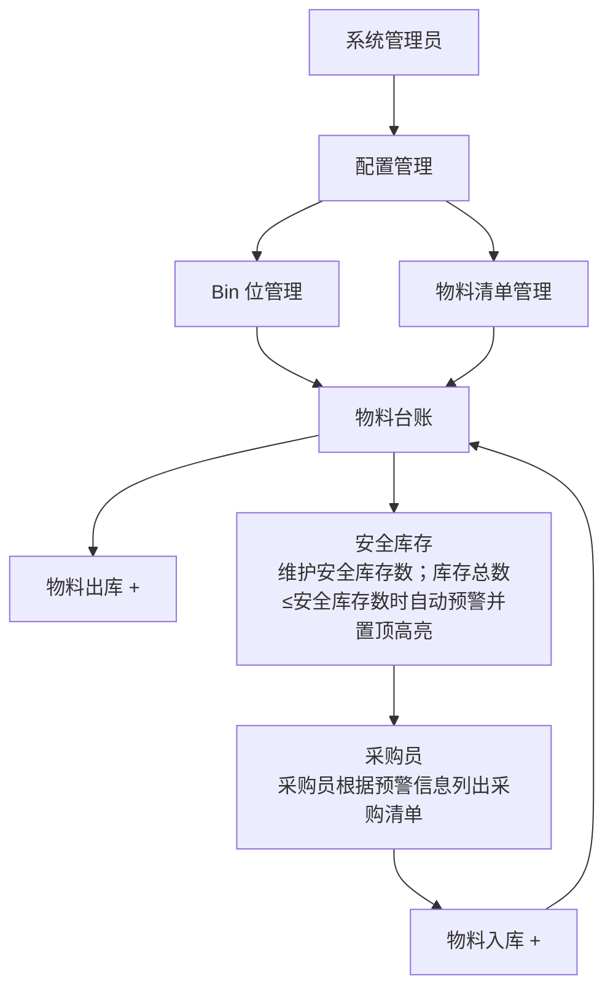

# 仓库管理系统

项目管理平台中 **个人中心**、**仓库管理** 与 **系统管理** 模块（个人中心为侧栏首位；其余平台模块菜单数据保留但隐藏）；个人中心首版提供账号信息与修改密码（原密码 / 邮箱验证码）；仓库域包含物料台账、物料出入库、安全库存、库存统计、配置管理（Bin位/物料清单）等能力。

## 技术栈

- **前端**：Vue 3 + TypeScript + Vite + Ant Design Vue 4（组件自动按需导入）+ Less（样式预处理器）
- **后端**：Java 17+ + Spring Boot 3 + MyBatis Plus + MapStruct（DTO/Entity/VO 映射）+ Apache Shiro + EasyExcel（导出）+ Apache POI（导入与测试）
- **数据库**：MySQL 8
- **对象存储**：MinIO

## 项目结构说明

本仓库根目录为 `Storage`；后端 Maven artifact/module 名称为 `storage-backend`，源码位于 [backend](backend)，前端源码位于 [frontend](frontend)。IDE 中看到的 `Storage` / `storage-backend` 模块分别对应仓库根与后端模块。

**业务域目录（P9 已完成）**：

- 后端：`com.storage.common.*`（含 `common.config`）、`com.storage.system.*`（含 `system.auth.config`）、`com.storage.warehouse.*`（仓库单模块按 controller/service/mapper/dto/entity/excel 分层）、`com.storage.design.*`（设计指引独立域）、`com.storage.experience.*`（经验库独立域）、`com.storage.infrastructure.file.*`（含 `file.config`）；详见 [ROADMAP.md](ROADMAP.md) P9。
- 前端：`views/warehouse`、`views/system`、`views/design`、`views/experience`；canonical 路径 `api/warehouse`、`types/warehouse`、`api/system`、`types/system`、`api/design`、`types/design`、`api/experience`、`types/experience`（根目录 shim 兼容旧 import）。

## 快速启动

### 推荐：Docker Compose 一句命令

需已安装 Docker。默认部署流程统一为 `docker compose up -d`，不再依赖手动启动前后端进程或重置数据库卷。

开发环境（包含开发端口映射）：

```bash
docker compose --env-file .env -f docker-compose.yml -f docker-compose-dev.yml up -d
```

生产部署（最小暴露面，复用既有 MinIO，不启动本项目 MinIO 容器）：

```bash
# 先手工维护 .env（含外部 MINIO_ENDPOINT / 凭据 / bucket），再执行：
docker compose --env-file .env -f docker-compose.yml up -d
```

也可使用统一入口脚本：

- Windows 双击：`start-dev.cmd`（本地热更新开发：Docker 仅启动 MySQL/MinIO，本机 `npm run dev` + `mvn spring-boot:run`；可加 `-NoOpenBrowser` 跳过打开浏览器）
- Windows 双击：`dev-up.cmd`（完整 Docker 部署，前端为构建镜像，改代码需 `-Build` 重建）
- Windows：`.\scripts\deploy-cli.ps1 -Profile dev [-Build]` / `-Profile prod`（dev 会自动 sync `.env`；prod 要求已有 `.env` 且配置外部 MinIO；dev 部署成功后会自动打开浏览器；可用 `-NoOpenBrowser` 跳过）
- Linux/macOS/Git Bash：`./scripts/deploy-cli.sh --profile dev [--build]` / `--profile prod`（同上，可用 `--no-open-browser` 跳过；若执行权限丢失可用 `bash scripts/deploy-cli.sh ...`）
- 启动脚本会等待后端健康检查与前端入口可访问后再打开浏览器，避免服务尚未监听时出现 `localhost` 拒绝连接。

环境自检：

```powershell
.\scripts\health-check.ps1 -Profile dev
```

生产部署自检：

```powershell
.\scripts\health-check.ps1 -Profile prod
```

Linux / macOS / Git Bash：

```bash
./scripts/health-check.sh --profile dev
./scripts/health-check.sh --profile prod
```

遇旧版 `material-ledger-*` 容器冲突时：

```powershell
.\scripts\cleanup-legacy-docker.ps1
```

Linux / macOS / Git Bash：

```bash
./scripts/cleanup-legacy-docker.sh
```

### 分步启动（进阶）

#### 1. 启动 MySQL（本地开发含 MinIO）

需已安装 Docker。在项目根目录执行：

```powershell
.\scripts\sync-worktree-env.ps1
docker compose --env-file .env -f docker-compose.yml -f docker-compose-dev.yml up -d
```

Linux / macOS / Git Bash 等价命令：

```bash
./scripts/sync-worktree-env.sh
docker compose --env-file .env -f docker-compose.yml -f docker-compose-dev.yml up -d
```

Shell 脚本已在 Git 中提交可执行位；若通过压缩包等方式获取代码导致权限丢失，可先执行 `chmod +x scripts/*.sh`，或直接使用 `bash scripts/<name>.sh`。

若本机 PowerShell 执行策略阻止 `.ps1`，可使用：

```powershell
powershell -ExecutionPolicy Bypass -File .\scripts\sync-worktree-env.ps1
```

`sync-worktree-env.ps1` / `sync-worktree-env.sh` 会根据**当前 git 分支**生成本地 `.env`（不入库），为各 worktree 分配独立端口、容器名与数据卷。

将自动创建 `storage` 数据库；**表结构与系统初始化数据由后端启动时 Flyway 迁移**（`backend/src/main/resources/db/migration/`），首次启动会执行 `V001__baseline_schema.sql` 并写入 `flyway_schema_history`。

**运行时业务数据不自动注入**：

- 所有运行环境（本地、worktree、生产）初始化后，仓库、设计指引、经验库等业务表均为空；台账、Bin、BOM、设计指引、经验类型等需由人员录入或通过导入功能维护。
- `V018` / `V019` 会在数据库仍处于历史纯种子快照时自动移除 Flyway 遗留的演示 INSERT；admin、菜单、权限等系统启动数据保留。
- 已有真实业务数据的数据库升级时不会被清空；若库中仍混有历史演示数据且已不满足纯种子条件，需人工识别并清理。
- 单元 / 集成测试继续使用 H2 + `schema-test.sql` 独立夹具，不受运行时迁移清理影响。

**Git worktree 端口分配**（逻辑库名均为 `storage`，隔离靠端口 + 独立 Docker 卷）：

| 分支 | Worktree 路径 | MySQL | MinIO API | MinIO Console |
|------|---------------|-------|-----------|---------------|
| `main` | `E:/Storage`（Windows 示例；Linux/macOS 可为实际 clone 路径） | **3307** | 9000 | 9001 |
| `feat/material-ledger` | `E:/Storage-worktrees/material-ledger`（示例） | **3308** | 9010 | 9011 |
| `feat/material-io` | `E:/Storage-worktrees/material-io`（示例） | **3309** | 9020 | 9021 |
| `feat/safety-stock` | `E:/Storage-worktrees/safety-stock`（示例） | **3310** | 9030 | 9031 |
| `feat/config-mgmt` | `E:/Storage-worktrees/config-mgmt`（示例） | **3311** | 9040 | 9041 |
| `feat/knowledge-base` | `E:/Storage-worktrees/knowledge-base`（示例） | **3312** | 9050 | 9051 |
| `feat/design-guidelines` | `E:/Storage-worktrees/design-guidelines`（示例） | **3313** | 9060 | 9061 |

切换 worktree 或分支后务必先执行 `sync-worktree-env.ps1`（Windows）或 `sync-worktree-env.sh`（Linux/macOS/Git Bash），再 `docker compose --env-file .env -f docker-compose.yml -f docker-compose-dev.yml up -d`。详见 [AGENTS.md](AGENTS.md)「Worktree 数据库隔离」。

已有数据库卷升级时，Flyway 通过 `baseline-on-migrate` 兼容历史卷，仅执行新增版本脚本；禁止把 `down -v` / 清空卷作为常规升级路径。`V025` 若检测到重复邮箱会 **安全中止迁移**，需管理员在 DBeaver 保留正确账号邮箱、清空或修正其他重复项后重启后端继续升级。迁移脚本须为 **UTF-8** 编码；迁移失败会阻断启动以避免静默漏表/漏列。

#### Flyway 升级与备份流程

已有数据的环境升级必须保留数据库卷，不能通过重建数据库解决版本冲突。推荐流程：

1. **先备份 MySQL**：部署前使用 `mysqldump` 或运维侧备份能力导出现有库，至少覆盖业务表与 `flyway_schema_history`。
2. **再部署代码/镜像**：拉取新代码后按需执行 `docker compose ... up -d --build`，或使用 `start-dev.cmd` / `dev-up.cmd` 选择重建镜像。
3. **让后端启动触发 Flyway**：后端启动时会自动执行尚未应用的 `Vxxx__*.sql` 增量脚本，保留已有导入数据。
4. **遇到 checksum mismatch 先停手**：这表示某个已经执行过的迁移文件被改过。不要清卷、不要手工改业务表、不要删除 `flyway_schema_history`；应恢复该历史迁移文件原内容，把结构变化补成新的更高版本迁移。
5. **迁移失败按错误处理数据**：例如唯一约束迁移发现历史重复数据时，先基于备份核对并清理冲突数据，再重新启动后端继续 Flyway；不要重新导库作为常规流程。

发布后已经进入任何数据库的迁移脚本（例如 `V001__baseline_schema.sql`）视为不可变快照；后续表结构变化只能新增 `V002+`、`V003+` 这类增量脚本。

默认连接信息见 [.env.example](.env.example)：

- **本地 dev 容器内互联**（`docker-compose-dev.yml`）：`mysql:3306`、`http://minio:9000`、`backend:8080`；backend 不要使用 `http://minio:9090` 或宿主机名访问本地 MinIO。
- **本地 dev 容器外管理访问**（宿主机/IP + 映射端口）：MySQL `${STORAGE_MYSQL_PORT}`（默认 `3307`）、MinIO API `${STORAGE_MINIO_PORT}`（默认 `9000`）、MinIO Console `${STORAGE_MINIO_CONSOLE_PORT}`（默认 `9001`）。
- **生产**：`docker-compose.yml` 仅部署 MySQL/backend/frontend；对象存储通过 `.env` 中的 `MINIO_ENDPOINT` 连接既有 MinIO，本项目不再发布 MinIO API/Console 端口。
- **显式容器名**（随 `COMPOSE_PROJECT_NAME` 隔离）：`${STORAGE_MYSQL_CONTAINER}`、`${STORAGE_MINIO_CONTAINER}`（仅 dev）、`${STORAGE_BACKEND_CONTAINER}`、`${STORAGE_FRONTEND_CONTAINER}`；容器 hostname 固定为 `mysql` / `minio`（仅 dev）/ `backend` / `frontend`。

内网部署示例（`COMPOSE_PROJECT_NAME=storage-main`，应用入口 `http://cnhuam0hmcprd01:4600/`）：

| 用途 | 地址 |
|------|------|
| 应用前端 | `http://cnhuam0hmcprd01:4600/` |
| DBeaver / MySQL CLI | `cnhuam0hmcprd01:3307`（库 `storage`，用户见 `.env`） |
| MinIO（既有实例，非本项目容器） | 由生产 `.env` 的 `MINIO_ENDPOINT` 配置，backend 容器内可达即可 |

数据库维护请通过 **DBeaver** 手工操作；本地 dev 的对象存储可通过 MinIO Console 维护。禁止把 `docker compose down -v`、删卷或脚本清库作为常规运维手段。本地 dev 修改 `MINIO_ACCESS_KEY` / `MINIO_SECRET_KEY` 后需保留数据卷并重建 backend/minio 容器，使 `.env` 与 MinIO 卷内凭据一致；若出现 `access key ID ... does not exist`，通常是凭据不一致而非 hostname 缺失。

其他 worktree 端口见上表；以 `scripts/sync-worktree-env.ps1` 或 `scripts/sync-worktree-env.sh` 生成的 `.env` 为准。

应用端口（各 worktree 通常相同，见 `.env`）：

- `BACKEND_PORT`：后端 HTTP 端口（默认 `8080`）
- `FRONTEND_PORT`：Vite 开发端口（默认 `5173`）
- `VITE_API_PROXY`：仅本地 Vite 开发模式使用；Compose Nginx 部署不依赖该值
- `APP_PUBLIC_BASE_URL`：忘记密码邮件链接使用的外部访问地址；base/prod 默认为 Nginx 入口 `http://localhost` 或真实域名，dev compose 会覆盖为 `http://localhost:${FRONTEND_PORT}`
- `JWT_SECRET`：JWT HMAC 签名密钥（本地默认仅用于开发，生产必须改为部署侧强密钥）
- `JWT_TTL_MINUTES`：JWT access token 有效期分钟数（默认 `120`）

`sync-worktree-env.ps1` / `sync-worktree-env.sh` 仅用于本地 dev：按分支重写 MySQL/MinIO 端口、容器名和卷名，但会保留已有 `.env` 或当前进程中的数据库/MinIO 凭据、`BACKEND_PORT` / `FRONTEND_PORT` / `VITE_API_PROXY` / `SESSION_COOKIE_*` / `RESET_ADMIN_PASSWORD_ON_STARTUP` / `JWT_*` / `UPLOAD_*` / `APP_PUBLIC_BASE_URL` / `PASSWORD_RESET_TOKEN_TTL_MINUTES` / `MAIL_*`。生产 `.env` 需手工维护，其中 `MINIO_ENDPOINT` 指向既有 MinIO。

### 部署交付核验

- Docker Compose 主路径已统一为 `docker compose up -d`；`--build` / `-Build` 仅作为显式重建选项。
- `--env-file .env` 用于 Compose 变量替换；service 级 `env_file: .env` 用于把 `.env` 注入容器，后端不再在 `environment` 中复制全量变量列表。
- 前端由 `frontend/Dockerfile` 构建并通过 Nginx 暴露，`/api` 由 Nginx 反向代理到后端服务，Compose 部署不依赖本地 Vite 代理。
- 本地 dev 容器内数据库与对象存储访问使用 hostname：`mysql:3306`、`http://minio:9000`、`backend:8080`；Compose 仅在 dev 覆盖中写入这些容器网络地址，宿主机/DBeaver/Console 才使用映射端口。
- 生产 `docker-compose.yml` 仅发布 MySQL 管理端口（默认 `3307`）与应用 Nginx 入口；MinIO 由部署侧既有实例提供，通过 `.env` 注入 `MINIO_ENDPOINT` 与凭据。
- Nginx 前端入口包含 gzip、hash 静态资源长缓存、`index.html` no-cache、SPA fallback 与 `/api` 反向代理配置。
- 后端默认不启用全局 CORS；Compose 通过 Nginx 同源代理 `/api/**`，本地 Vite 开发通过 dev proxy 转发 `/api/**`。
- Linux/macOS/Git Bash 版脚本保持 LF 与可执行位；常规验证可运行 `bash -n scripts/*.sh` 与两套 `docker compose ... config`。
- 正式发布前先在本地跑通 `docker-compose.yml` 服务并确认后端 `/health` 与前端入口正常；发布 tag 使用语义化版本格式 `vMAJOR.MINOR.PATCH`，例如 `v1.0.0`。

### 2. 启动后端

#### 推荐：IntelliJ IDEA 断点调试（日常开发）

功能开发与排错**优先**在 IDEA 中单步调试，而非每次 `mvn package` 进容器或仅靠 `mvn spring-boot:run` 看日志。

1. 确保 Docker 已运行：`.\scripts\sync-worktree-env.ps1` 或 `./scripts/sync-worktree-env.sh` → `docker compose --env-file .env up -d`
2. IDEA 打开 `backend` 模块，新建 **Spring Boot** Run/Debug Configuration：
   - Main class：`com.storage.StorageApplication`
   - Working directory：`backend` 目录
   - 环境变量：安装 [EnvFile](https://plugins.jetbrains.com/plugin/7861-envfile) 插件并勾选项目根目录 `.env`；或手动填入 `MYSQL_*`、`MINIO_*`、`BACKEND_PORT`
3. 在 `*Controller` / `*Service` 打断点（见 [AGENTS.md](AGENTS.md)「开发与调试规范 → 断点推荐位置」）
4. 以 **Debug** 启动后端
5. 另开终端：`cd frontend && npm run dev`
6. 浏览器或 Postman 复现请求，单步跟进

**注意**：IDEA Debug 运行后端时，不要与 Compose 内后端容器同时占用同一端口；如需本地断点，建议暂时停止 `backend` 容器。

#### 备选：命令行启动

需 Java 17+ 与 Maven。在 `backend` 目录：

```bash
cd backend
mvn spring-boot:run
```

后端默认地址：`http://localhost:8080`（或 `.env` 中 `BACKEND_PORT`）

### 3. 启动前端

需 Node.js 20+。在 `frontend` 目录：

```bash
cd frontend
npm run dev
```

前端默认地址：`http://localhost:5173`（或 `.env` 中 `FRONTEND_PORT`），开发环境通过 Vite 代理将 `/api` 转发至 `VITE_API_PROXY`（默认后端 8080），不需要后端 CORS。
首次本地 Node 开发或 `package-lock.json` 变更时，再在 `frontend` 目录执行 `npm install`。

### Postman / curl 边界测试

前端表单 `rules` 仅为体验；**后端校验才是安全门禁**。改 API 后建议用 Postman 直接打接口（可绕过前端）：

1. `POST /api/auth/login` 获取 JWT access token，后续请求携带 `Authorization: Bearer <token>`
2. 故意发送非法 body，例如：注册空用户名、客户必填字段缺失、出库数量超过库存
3. 期望 **HTTP 400** 与 JSON `message` 字段；不应 500 或静默成功

校验失败入口断点：`GlobalExceptionHandler.handleValidation`；业务规则断点：对应 `*Service.save` / `update`。

**页面入口**：

- 默认打开 `/login`（当前为 Shiro + JWT 鉴权，前端通过 Pinia + localStorage 保存 access token）；注册 Tab：`/login?tab=register`；忘记密码申请 Tab：`/login?tab=forgot`；邮件链接重置 Tab：`/login?tab=reset&token=...`
- **个人中心**（侧栏首位）：账号信息、原密码改密、绑定邮箱验证码改密；改密成功后递增 `sys_user.token_version`，该用户所有旧 JWT 立即失效并需重新登录
- 个人中心支持维护 **可选手机号**（无需短信验证）；具备 `system:user:write` 权限的管理员可在用户管理中维护
- 登录态改密 API：`PUT /api/auth/password`（原密码）、`POST /api/auth/password/verification-code`（发码）、`PUT /api/auth/password/by-verification-code`（验码改密）；验证码仅发往当前用户绑定邮箱，默认 6 位、10 分钟有效、60 秒发送冷却
- 登录态个人信息 API：`PUT /api/auth/me/phone`（当前用户维护手机号，可选、最大 32 字符，留空清除）
- 支持开放注册，新用户默认 `USER` 角色（仅物料台账只读）；注册账号 3-32 字符、密码至少 6 位；**注册必须先向邮箱发送验证码并校验通过**；**一个邮箱只能绑定一个账号**
- 登录支持 **账号或邮箱 + 密码**；账号与显示名称 **禁止包含空格或空白字符**
- 个人中心向本人展示 **完整绑定邮箱**（不再脱敏）
- 注册支持可选邮箱；**用户与客户邮箱统一保存为小写**（写入时 trim + lowercase；已有 MySQL 卷由 Flyway `V024` 自动归一化历史数据）；**忘记密码仅凭绑定邮箱**申请邮件一次性链接，链接默认 30 分钟有效，后端统一错误提示并限流（同一邮箱 15 分钟最多 5 次失败）
- 邮件配置通过 `.env` 预留：`APP_PUBLIC_BASE_URL`、`PASSWORD_RESET_TOKEN_TTL_MINUTES`、`MAIL_HOST`、`MAIL_PORT`、`MAIL_USERNAME`、`MAIL_PASSWORD`、`MAIL_FROM`、`MAIL_SMTP_AUTH`、`MAIL_SMTP_STARTTLS_ENABLE`；Gmail 默认 `smtp.gmail.com:587` + STARTTLS，`MAIL_PASSWORD` 使用 Google 应用专用密码
- 「记住密码」仅 localStorage 保存账号（不存密码）
- 未登录访问业务页会自动跳转到登录页
- 默认管理员：`admin` / `admin123`（可管理用户/角色/菜单）
- 系统管理新建用户默认初始密码后缀：`@123`（即 `{username}@123`）

**动态菜单与路由**：

- 业务路由由后端菜单树驱动：`sys_menu.path` 决定路由路径，`permission` 决定访问权限，`component_key` 存前端模块路径并决定懒加载组件。
- 登录后默认页优先进入库存统计（`warehouse:stats:read`）；无该权限时回退到用户第一个可访问页面。
- 当前侧栏展示 **个人中心**、**仓库管理**、**系统管理** 三个顶层模块；设计指引、经验库等平台模块菜单记录保留但隐藏，便于后续继续开发。
- 菜单类型为 **一级菜单（TOP）**、**子菜单（SUB）**、**按钮权限（BUTTON）**；按钮权限挂在页面子菜单下，不进入侧栏导航树。
- 子菜单可无 `permission` 作纯分组（如「配置管理」），侧栏仅展示其下已授权子页面；可见且有路由的页面子菜单必须填写权限标识与组件路径。
- 角色授权采用 **仅向上继承**：勾选子菜单或按钮时自动补齐全部祖先；勾选一级菜单不会自动授予其全部子权限。
- 菜单管理维护“组件路径”；可见且有路由路径的页面子菜单必须填写组件路径，分组子菜单与按钮权限不能填写路由或组件路径。
- 组件路径以 `views/` 或 `components/` 开头，例如 `views/warehouse/MaterialLedgerView.vue`、`components/system/MenuManagePanel.vue`；前端通过 `import.meta.glob` 解析可路由模块，不再维护人工组件映射表。

### 样式约定（Less）

- 统一预处理器为 **Less**；全局入口为 [frontend/src/style.less](frontend/src/style.less)。
- 公共 token 与 mixins 位于 [frontend/src/styles/](frontend/src/styles/)（`variables.less`、`mixins.less`、`index.less`）。
- 新增或改动带样式的组件时，使用 `<style scoped lang="less">`，优先复用 `@color-*`、`@spacing-*`、`@radius-*` 等变量，以及 `btn-success-primary`、`row-highlight`、`filter-form-label` 等 mixin。
- 存量带 `<style>` 的页面已全部迁移 Less；登录页使用独立 `@color-login-*` 品牌 token。

### Compose 部署访问方式

启动完成后：

- 前端入口：`http://localhost:${APP_PORT}`（或 dev profile 下 `http://localhost:${FRONTEND_PORT}`）
- 前端请求 `/api/**` 由 Nginx 反向代理至 `backend:8080`
- 无需手动启动 `mvn spring-boot:run` / `npm run dev` 即可完成完整部署访问
- `backend` 容器通过 `GET /health` 健康检查（不经 `/api` 鉴权链）；`frontend` 等待 backend 变为 healthy 后再启动，避免刚启动时 `/api` 短暂失败

### 手动测试文件上传（MinIO）

登录后可用 curl 测试通用上传 API（本地 dev 需先启动含 MinIO 的 dev Compose）：

```bash
curl -X POST http://localhost:8080/api/files/upload \
  -H "Authorization: Bearer <token>" \
  -F "file=@README.md"
```

先调用 `POST /api/auth/login` 获取 `accessToken`，再用 Bearer token 携带凭证上传。本地 dev 的 MinIO API 默认映射到 `http://localhost:9000`，Console 默认 `http://localhost:9001`。生产环境由既有 MinIO 承接，无需本项目暴露 MinIO 端口。本地 dev 建议运行 `health-check -Profile dev`，确认 `minio-credentials`、`minio-live`、`minio-from-backend` 均通过后再实际上传小文件验证；生产可运行 `health-check -Profile prod` 检查 backend 到外部 `MINIO_ENDPOINT` 的连通性。

物料清单图片可在 **配置管理 → 物料清单** 新增/编辑弹窗中上传多张图片（JPG/PNG/WebP/GIF，每条记录最多 20 张）；经验库附件支持任意类型文件（每条记录最多 20 个）。前端通过 `GET /api/files/upload-policy` 读取运行时上传策略，不在浏览器侧拦截文件大小或限制并发。后端通用附件仅校验大小与鉴权；BOM 图片在保存时继续校验图片 MIME，图片支持预览，普通附件通过下载接口获取。Compose/Nginx 部署默认 `client_max_body_size` 对齐 `UPLOAD_MAX_REQUEST_SIZE_BYTES`（当前默认 5.125 GiB），后端 Spring multipart 与业务层默认单文件上限 5 GiB（`UPLOAD_MAX_SIZE_BYTES=5368709120`）。修改 `application.yml` 或 `frontend/nginx.conf` 后需显式重建 Docker 镜像；若公司上游网关另有请求体限制，须同步放宽。物料清单 Excel 导入/导出不含图片列。

## 经验库

经验库是独立平台能力，入口为 **经验库**（`/platform/experience`），不属于仓库管理模块。当前支持：

- 类型可维护：类型管理弹窗支持新增、编辑、停用、删除；已被经验记录引用的类型禁止删除。
- 经验记录 CRUD：字段包含类型、描述、影响、建议、行动方案、记录人、记录时间。
- 查询与批量操作：按类型、记录人、关键字、记录时间筛选，支持分页、批量导出、批量删除。
- 关联项目：先按自由标签保存项目名称/编号，不依赖尚未落地的项目中心主数据。
- 文件/图片：记录可挂多个附件；图片走 `/api/files/preview`，普通附件走 `/api/files/download`。
- Excel：导出当前筛选结果；导入不含附件列，类型必须已存在，项目可用逗号/分号/换行分隔。

## 仓库业务流程

仓库模块以 **物料台账** 作为实时库存数据库：台账记录当前仓库中每种物料的库存数量与所在 Bin 位；新增库存必须通过入库流水累加，领用必须通过出库流水扣减，避免直接手工改台账导致库存失真。



流程口径：

1. **基础配置信息**：系统管理员先维护配置管理中的 **Bin 位管理** 与 **物料清单管理**。Bin 位是库存位置唯一来源，物料清单是入库物料基础信息来源。
2. **基于配置入库**：采购来的物料登记入库时，选择物料清单中的物料明细，并选择需要存放的 Bin 位；提交后同步增加到物料台账。
3. **台账增减库存**：物料台账只记录库存结果。入库会增加台账库存，出库会扣减台账库存；全部出库后库存为 0 的台账仍保留以承接历史流水，列表默认隐藏无库存记录，可按需切换查看。
4. **从台账领出**：出库用于仓库中取出物料投入使用，必须从台账选择现有库存物料，确保库存不足、安全库存预警等校验准确。
5. **安全库存联动采购**：安全库存读取台账信息；当库存总数 ≤ 安全库存数（且安全库存数 > 0）时自动展示「库存预警=是」并置顶高亮，采购员可在安全库存页按当前筛选或勾选预警行生成采购清单。
6. **采购后回收入库**：采购清单只承载补货建议，不处理采购审批/财务结算；物料到货后仍回到物料入库，按物料清单 + Bin 位写入台账。

### 物料清单管理验收口径

- 入口：**配置管理 → 物料清单**（`/warehouse/config/bom`）；写权限 `warehouse:bom:write`。
- 字段：品类/统称/名称必填；品牌/规格/备注/图片选填；备注最长 999 字符。
- 筛选：品类、统称、品牌联动下拉；名称、规格支持关键字查询；支持查询、重置、分页。
- 列表：默认按 **更新时间倒序**；展示品类、统称、品牌、名称、规格、备注、图片（首图 + 数量提示）、更新日期；操作含查看/编辑/删除。
- 重复校验：新增/编辑/导入时，若 **品类 + 统称 + 品牌 + 名称** 与已有记录完全相同，后端返回明确错误提示。
- 图片：支持多选上传、预览与清除（最多 20 张）；持久化在 `warehouse_bom_image`；Excel 不含图片列。
- 批量：支持批量导出、批量删除、导入与模板下载。
- 删除保护：已被物料台账引用的清单项禁止删除。
- 入库联动：物料入库可从清单选择基础信息；Excel 入库导入校验四字段存在，并在提供规格时核对与清单一致。

### 物料出入库管理验收口径

- 入口：**仓库管理 → 物料出入库**（`/warehouse/material-io`）；写权限 `warehouse:material-io:write`。
- 筛选：品类、统称、品牌、名称、型号、Bin 位、**物料类型**（入库/出库）、操作时间；支持查询、重置、分页。
- 列表：展示物料身份、数量、**单价快照**、项目编号、备注、物料类型、**自动操作人**、时间；默认按操作时间倒序。
- 新增：支持入库/出库切换；**入库**从物料清单 + Bin 位选择，**出库**从物料台账选择并展示可用库存；数量/单价/备注可填，操作人与时间由后端自动记录。
- 单价：每条流水保存 `unit_price` 历史快照；页面未填写时默认沿用台账当前单价。
- Excel：导出/模板包含单价、用途、项目编号、物料类型；导入支持填写单价与用途，操作人仍由后端自动记录。
- 库存不变量：出库数量不得超过可用库存；删除/编辑会回滚并重算库存；同一批次不可重复同一台账物料。

迁移说明：

- `V007__material_ledger_natural_key_unique.sql` 会将台账 `brand = NULL` 归一为空串，并为 `category + generic_name + brand + name + model + bin_location` 加唯一约束，防止同一物料同一 Bin 位拆成多条库存。
- 已有数据库卷升级时只需重启后端触发 Flyway；如果历史数据中存在重复台账，迁移会阻断启动，需要先人工核对出入库流水并清理重复台账，不会自动合并库存。

## 当前功能

- [x] 登录页 + Shiro JWT 登录/登出/当前用户 + Pinia 全局 auth store + **开放注册** + **第五期优化**（左栏插画、记住账号、URL Tab、注册校验、交互打磨）
- [x] 路由守卫与 API 401 拦截（Bearer token）+ **路由 permission 校验**
- [x] **系统管理**：用户管理、角色管理、菜单管理、客户管理（独立侧栏菜单；多角色分配、授权只读面板、Excel 导入导出）+ SideMenu 动态导航
- [x] MinIO 对象存储基础设施 + `POST /api/files/upload`
- [x] **第六期平台壳层**：DB 导航种子（个人中心/项目/采购/设计/技能/经验/财务 + 仓库 5 项含库存统计与配置管理）、占位路由、`ComingSoonPage` 复用组件
- [x] **第七期壳层 UI 补全**：动态 TabBar（ADMIN 预置个人中心/项目中心）、壳层 `/platform/*` 路由、侧栏点击无 toast
- [x] **第八期 DevX**：`dev-up` 一键环境、`health-check` 自检、`cleanup-legacy-docker`、MySQL 就绪等待、`material_ledger` 中文修复迁移
- [x] 完整平台壳层（侧栏动态导航 + 顶部可关闭页签 + 退出登录）；页签支持右键菜单（刷新、关闭左侧/右侧/其它、清空全部）与拖拽排序；**逐页 KeepAlive** 切换保留页面状态，刷新/关闭/清空才销毁对应缓存
- [x] 物料台账列表页（筛选、分页、行选择，定位为实时库存查询视图；默认仅显示有库存，清空库存状态后查询全部）
- [x] 后端分页查询 API 与筛选选项 API
- [x] 物料台账查看（右侧抽屉，操作列「查看」）
- [x] 物料台账导出 Excel（按当前筛选条件导出全部结果，含库存状态筛选；批量导出勾选行后自动清空选择）
- [x] 物料台账只读化：保留详情、导出、批量导出和出入库历史，隐藏新增/导入/模板/编辑/删除入口
- [x] 物料台账筛选联动（品类 → 统称 → 品牌 → 型号；Bin 位来自 Bin 主数据；库存状态默认有库存）
- [x] 公共复用基础层（前端 http/types/utils、后端 converter/query/excel/web）
- [x] **第十一期 11.1 Bin位管理**：CRUD + Excel + 台账 Bin 下拉/保存校验；排必填、列/层选填，编号按 `排` / `排-列` / `排-列-层` 自动生成；列表按更新时间倒序、Bin位编号升序；支持批量导出
- [x] **第十一期 11.2 物料清单管理**：CRUD + 品类联动筛选 + Excel（`warehouse_bom` 主数据）+ 四字段重复校验 + 更新时间倒序 + 规格字段
- [x] **第十一期 11.3 台账 ↔ 物料清单关联**：表单「从清单选择」、四字段存在校验 + 规格匹配、`GET /api/materials/bom-catalog`、清单删除引用保护
- [x] **第十一期 11.4 物料清单 MinIO 图片**：`warehouse_bom_image` 多图持久化、表单多图上传/预览/清除、列表首图与详情多图
- [x] 客户管理业务 CRUD、忘记密码
- [x] **第十三期物料出入库**：`material_io_record` 流水、批量入库/出库、库存联动、Excel 导入导出（`warehouse:material-io:write`）
- [x] **第十四期物料出入库完善**：筛选联动修复、Excel 原子导入、台账选择器联动筛选、批量表单库存列、台账删除 IO 引用保护、只读用户可下载模板
- [x] **第十五期物料出入库优化**：后端集成测试、可用库存 UI、台账↔出入库追溯、编辑禁改类型、出库选择器增强
- [x] **第十六期物料出入库复用与契约**：`useWarehouseMaterialFilters`/`WarehouseMaterialFilterPanel`、深链 composable、IO↔台账互跳、后端 ioType/重复物料不变量
- [x] **第十七期追溯闭环与测试**：台账 `?materialLedgerId=` 打开详情、`importBatch` 重复拦截、H2 集成测试扩展
- [x] **第十八期追溯体验与复用深化**：深链新增预填、IO↔台账读权限对称、编辑禁改物料、列/query 复用、`useMaterialLedgerList`、`MaterialIoDetailDescriptions`
- [x] **第十九期流水深链与质量基建**：`?id=` 打开出入库详情、`MaterialStockMutationService`、Vitest + `useMaterialIoStock` 单测
- [x] **第二十期列表复用与深链闭环**：`useMaterialIoList`、深链列表定位与 URL 同步、Excel 导入出库超库存行级报错、深链/库存单测扩展
- [x] **第二十一期追溯快捷与契约瘦身**：上下文条新增入库/出库、`useCrudRouteDetail`、`MaterialIoUpdateDTO`、详情复制链接
- [x] **第二十二期安全库存管理**：`safety_stock` 表、预警黄行、导出/编辑 upsert、`SafetyStockView`、`warehouse:safety-stock:write`
- [x] **安全库存采购清单**：安全库存页可按当前筛选或勾选预警行生成采购清单 Excel，建议采购数 = 安全库存数 - 当前库存；采购清单不承接审批/结算，后续到货仍通过入库流水回写台账
- [x] **出入库自动化录入**：页面新增不再手填操作时间，提交时由后端自动记录操作时间与自动操作人；用途/项目编号/单价快照已纳入 Excel 与详情展示
- [x] **第二十四期出入库 UI 优化**：`MaterialIoFilterPanel`、`MaterialIoContextBar`、工具栏「更多」、新增弹窗条件列与预警列、安全确认 checkbox
- [x] **第二十五期库存统计与项目关联**：`GET /api/warehouse-stats/overview`、`InventoryStatsView`、`project_ref` 项目编号、出入库工具栏新增下拉
- [x] **物料台账只读与入库配置选择**：新增入库从物料清单/BOM 选择物料基础信息，从 Bin 位管理选择位置并支持编号/排/列/层定位；出库仍从台账选择以保障库存校验
- [x] **出入库导入配置化入库**：Excel 入库行按物料清单 + Bin 位校验配置，台账不存在时自动创建 0 库存台账后写入入库流水；出库导入仍必须匹配现有台账并校验库存
- [x] **物料台账 API 写入口收口**：外部台账 Controller 仅保留查询/筛选/导出/详情，库存新增、扣减与到货补录统一走出入库流水；DB 增加台账自然键唯一约束
- [x] **Excel 导出复用优化**：`useExcelImportExport` 支持纯导出页面可选导入函数，安全库存采购清单复用同一 Blob 下载/错误处理流程
- [x] **第二十六期客户管理与忘记密码**：`sys_customer` CRUD/Excel、`CustomerManageView`、`POST /api/auth/forgot-password`、登录页 `?tab=forgot`
- [x] **第三十期忘记密码邮件链接重置**：Google SMTP 环境变量预留、`password_reset_token`、`POST /api/auth/reset-password`、登录页 `?tab=reset&token=...`
- [x] **第二十七期差距收敛**：文档与客户占位表述同步、台账路由读权限、注册可选邮箱 + admin 种子邮箱、库存统计 `recentDays` 选择器、台账/Bin/客户 import 集成测试、GitHub Actions CI
- [x] **第二十八期开发与调试规范**：环境变量门禁、IDEA 断点工作流、前后端双端校验 checklist、启动脚本端口参数化
- [x] **第三十四期跨平台 DevX**：补齐 Linux/macOS/Git Bash 版 `deploy-cli.sh` / `sync-worktree-env.sh` / `wait-mysql.sh` / `health-check.sh` / `cleanup-legacy-docker.sh`
- [x] **第二十九期质量门禁与安全加固**：Docker/CORS 凭据参数化、迁移 fail-fast + 条件 DDL、忘记密码统一提示与限流、Auth Controller 集成测试、CI 增加前端 build、路由懒加载 + AntD 按需导入
- [x] **第三十一期模块复用复查与废弃物清理**：复核仓库/系统同类列表页仍复用公共 CRUD/composable/utils 层，清理未引用脚手架注释文件与 Vite 模板残留
- [x] **第三十二期安全门禁复查与上传加固**：复核环境变量、CORS、Session、忘记密码、迁移脚本与敏感信息门禁；上传增加图片魔数校验
- [x] **第三十三期系统环境变量一致性审核**：`.env.example` 与 `worktree-db.ps1` 变量清单一致；启动脚本显式注入后端运行环境变量；文档补齐 SSOT
- [x] **第三十五期 Pinia + JWT 鉴权迁移**：Pinia auth store、JWT access token、本地刷新恢复、Bearer 请求注入、无状态 Shiro JWT 认证链路
- [x] **第三十六期动态菜单与动态路由**：菜单 `component_key` 契约、Pinia menu store、登录后动态注册业务路由、菜单管理维护组件路径
- [x] **第三十七期样式预处理器统一**：引入 Less、`frontend/src/styles/` 公共 token/mixins、布局与 CRUD 公共层迁移、代表业务页验证
- [x] **P8 Flyway 数据库版本管理**：Flyway 接管 schema 迁移、`V001__baseline_schema.sql` baseline、关闭 `spring.sql.init` 主路径、CI MySQL Flyway 校验
- [x] **P1–P10 架构收敛**：Compose backend healthcheck、JWT 登出黑名单、动态路由系统管理嵌套契约、Pinia store 测试基线（详见 [ROADMAP.md](ROADMAP.md)）
- [x] **经验库独立域**：`com.storage.experience.*`、`views/experience`、经验类型/记录 CRUD、关联项目标签、附件上传/下载、Excel 导入导出、`V008__experience_library.sql`

## 设计指引

- 入口：侧栏「设计指引」，菜单组件路径为 `views/design/DesignGuideView.vue`。
- 定位：独立于仓库管理的平台模块，不参与库存、出入库、采购审批或财务结算。
- 功能：设计指引主表支持产品类型、项目阶段、适用范围、检查项筛选，支持新增、编辑、查看、删除、批量删除、导入、导出和模板下载。
- 配置：新增/编辑弹窗内通过齿轮进入「产品类型配置」和「阶段配置」，配置支持启用/停用、编辑、删除、导出；已被设计指引引用的配置禁止删除。
- 数据：产品类型和阶段在设计指引中保存编号/名称快照，配置后续重命名不影响历史记录展示与导出。
- 权限：读权限 `platform:design:read`，写权限 `platform:design:write`；默认仅 ADMIN 授权。
- 数据库：`V009__add_design_guidelines.sql` 追加 `design_product_type`、`design_stage`、`design_guide` 三张表并迁移菜单占位页；已有卷通过 Flyway 增量升级，无需清库，升级前仍建议备份 MySQL。

## 协作约定（多模型）

在 Cursor 中建议按任务属性分工，而不是固定单模型完成所有环节：

- `Composer 2.5`：执行与验证主力（改代码、跑命令、调试、补测试、闭环验收）
- `GPT-5.5`：规划主力（需求拆解、方案比较、风险识别、验收标准）
- `Claude Sonnet`：文档主力（README/ROADMAP/PR 描述/发布说明/复盘）

推荐流水线：

1. `GPT-5.5` 输出计划与边界；
2. `Composer 2.5` 按计划实施并验证；
3. `Claude Sonnet` 产出文档与沟通材料。

## 安全与生产部署要点

- 本仓库默认凭据（`admin123`、`storage123`、`minioadmin123`）仅用于本地开发，生产部署必须轮换为强密码
- `POST /api/auth/register` 是否对公网开放须由部署侧显式评估；忘记密码接口已改为邮件一次性链接，但仍需配合 HTTPS、可信前端域名与限流策略
- 忘记密码 token 仅明文出现在邮件链接中，数据库保存 SHA-256 哈希，默认 30 分钟过期且使用后失效；失败限流为单实例内存级（15 分钟 5 次，按邮箱计），多实例生产需迁移到 Redis/网关限流
- Google SMTP 默认按 Gmail 直连预留：`smtp.gmail.com:587` + STARTTLS；`MAIL_PASSWORD` 使用 Google 应用专用密码，不提交真实邮箱密码。公司 Workspace relay 可通过环境变量切换到 `smtp-relay.gmail.com`
- 当前鉴权主路径为 Shiro + JWT；access token 存储在前端 localStorage。JWT 携带 `token_version` 声明，改密后会递增用户版本并使旧 token 失效。`POST /api/auth/logout` 会将当前 Bearer token 的 `jti` 写入服务端黑名单，登出后同 token 无法继续访问受保护 API。生产环境需启用 HTTPS，`JWT_SECRET` 必须使用部署侧强密钥，并持续防护 XSS 风险；如需第三方前端跨域直连后端，应优先在 Nginx/网关层显式配置跨域策略
- 默认管理员密码自动重置能力仅建议本地排障开启，生产应关闭该初始化开关，避免启动时回退弱密码
- 文件上传以后端校验为准：通用内网附件允许任意类型，单文件默认 ≤5 GiB、每条记录最多 20 个附件；BOM 图片与图片预览继续校验图片 MIME，Excel 导入继续校验表格格式；前端不做文件大小预检，也不做应用级并发队列。Compose/Nginx 部署需保证 `frontend/nginx.conf` 的 `client_max_body_size` 不小于后端 `UPLOAD_MAX_REQUEST_SIZE_BYTES`（当前默认 5.125 GiB），且修改配置后需显式重建镜像。
- GitHub Actions CI：[`CI workflow`](https://github.com/z136606021-star/Storage/blob/main/.github/workflows/ci.yml)（后端测试 + 前端测试/构建）

后端测试：`cd backend && mvn test "-Dspring.profiles.active=test"`

前端测试：`cd frontend && npm run test`

前端构建：`cd frontend && npm run build`（CI 同步执行，用于捕获类型与模板错误）

## 远端仓库

https://github.com/z136606021-star/Storage.git

历史变更记录见 [CHANGELOG.md](CHANGELOG.md)。

后续优化路线见 [ROADMAP.md](ROADMAP.md)。

协作者与 AI 代理请参阅 [AGENTS.md](AGENTS.md)。新增功能前须按 `AGENTS.md` 的「模块复用与可维护性门禁」检查并优先复用 `CrudListPage`、`usePaginatedCrudList`、`useExcelImportExport`、`api/http.ts`、`types/common.ts`、`utils/`、`converter/`、`query/`、`excel/` 等公共层。
